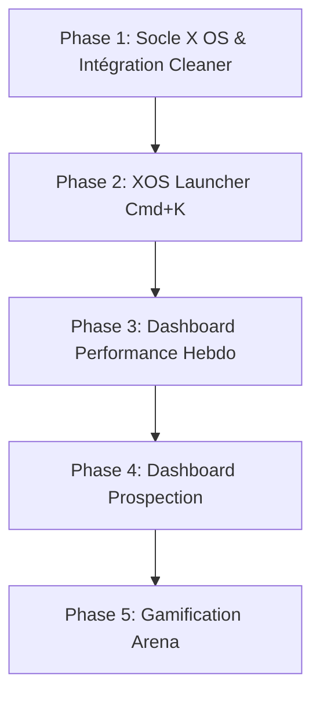

# 🌌 Projet X OS — Portail Intranet de Pilotage Commercial

Le projet **X OS** (jeu de mots avec XOS et Operating System) est un portail intranet conçu sous la forme d'un **système d'exploitation virtuel (Virtual Desktop)** s'exécutant dans le navigateur. 

L'objectif est double :
1. **Pour les Managers** : Offrir un cockpit de pilotage en temps réel de la performance commerciale et de l'hygiène du CRM.
2. **Pour les Commerciaux** : Simplifier leur quotidien en réduisant les frictions de saisie et en priorisant leurs actions avec des outils simples et interactifs.

---

## 🎨 Design System & Identité Visuelle (Charte XOS)

Le portail adoptera une esthétique **Dark Mode Premium & Glassmorphism** inspirée des codes visuels de [XOS Learning](https://www.xos-learning.fr/) et de l'interface bureau virtuelle partagée par Thibault Marty (Ottho) :

*   **Palette de couleurs** :
    *   `Fond principal` : Bleu Nuit profond (`#0D173F`) pour l'élégance et le confort visuel.
    *   `Accents & Sélections` : Violet néon (`#8B5BFA`) pour les éléments actifs, boutons primaires et focus.
    *   `Points d'attention / Alertes` : Jaune Lumineux (`#FFF96F`) pour attirer l'œil sur les anomalies.
    *   `Bordures & Séparateurs` : Translucide (`rgba(255,255,255,0.08)`) avec un léger flou de fond (`backdrop-filter: blur(12px)`).
*   **Typography** : Police sans-serif géométrique moderne (`Outfit` ou `Inter` via Google Fonts).
*   **Mise en page "Bureau Virtuel"** :
    *   **Fond d'écran** : Dégradé fluide et animé entre les couleurs de la charte.
    *   **Le Dock X OS** : Barre d'applications flottante en bas de l'écran avec effet de reflet et zoom au survol.
    *   **Gestionnaire de Fenêtres** : Possibilité d'ouvrir, fermer (rouge), réduire (jaune) ou agrandir (vert) chaque outil dans une fenêtre flottante déplaçable.

---

## 🚀 Les Applications du Dock (Le Hub X OS)

### 1. 🗑️ CRM Cleaner (Hygiène CRM) — *Actuel*
L'application actuelle de détection et traitement en lot des opportunités défectueuses.
*   **Fonctionnalités** : Filtrage croisé par types de vente, familles de raisons (ET/OU), réassignation en lot au propriétaire du compte, fermeture assistée avec contrôle Picklist Salesforce.
*   **Statut** : Opérationnel, à intégrer dans le gestionnaire de fenêtres.

### 2. 📈 Weekly Perf (Cockpit Hebdomadaire) — *Nouveau*
Suivi hebdomadaire de la performance commerciale pour piloter le rythme de vente.
*   **Fonctionnalités** :
    *   **Le "Pulse"** : Nombre d'appels, rendez-vous et propositions envoyées sur la semaine par commercial.
    *   **Pipeline Généré vs Gagné** : Graphique comparatif de la création de valeur et du taux de closing.
    *   **Le Taux d'Effort** : Ratio d'opportunités passées à l'étape supérieure.

### 3. 🎯 Lead Tracker (Suivi de la Prospection) — *Nouveau*
Visualisation du "Pipe d'entrée" et de la vélocité de prospection.
*   **Fonctionnalités** :
    *   **Entonnoir de Prospection** : Taux de transformation des leads en opportunités qualifiées.
    *   **Bottleneck Detector** : Identification des étapes où les prospects stagnent le plus longtemps.
    *   **Performance des canaux** : Efficacité comparée des campagnes, du site web ou de l'outbound.

### 4. ⚡ XOS Launcher (Spotlight Command - Game Changer) — *Nouveau*
Un centre de commande rapide inspiré de Spotlight (macOS) accessible via `Cmd + K`.
*   **Fonctionnalités** :
    *   Recherche ultra-rapide de comptes, contacts ou opportunités Salesforce.
    *   **Actions instantanées par raccourcis clavier** :
        *   `/log` : Saisie d'une note d'appel rapide sans ouvrir Salesforce (synchro API).
        *   `/create` : Création express d'un prospect.
        *   `/clean` : Lance une analyse d'hygiène sur un compte donné.
    *   *Bénéfice* : Gain de temps massif pour les commerciaux par rapport aux temps de chargement de Salesforce.

### 5. 🏆 XOS Arena (Gamification & Challenges) — *Nouveau*
Rendre la saisie CRM et la prospection ludiques grâce au challenge d'équipe.
*   **Fonctionnalités** :
    *   **Défis hebdomadaires** : *"Le premier à nettoyer toutes ses opportunités en retard"*, *"Meilleur convertisseur de la semaine"*.
    *   **Leaderboard** : Progression en direct des commerciaux avec médailles et badges animés.
    *   *Bénéfice* : Augmente l'adoption du CRM et la qualité des données par l'émulation collective.

### 6. ⚙️ Hub Connexion (Paramètres & Status) — *Nouveau*
*   **Fonctionnalités** : Statut de la connexion API Salesforce, quotas d'appels API restants, configuration des seuils de retard et gestion des exclusions de comptes.

---

## 📅 Stratégie d'Implémentation

### Phase 1 : Le Bureau Virtuel (Socle)
*   [ ] Création du layout HTML/CSS principal avec le fond d'écran XOS et le Dock.
*   [ ] Écriture du gestionnaire de fenêtres en JS natif (déplacement, redimensionnement, focus, réduction).
*   [ ] Migration du code existant de `dashboard.html` dans la fenêtre `CRM Cleaner`.
*   [ ] Déploiement automatique sur Vercel.

### Phase 2 : XOS Launcher (`Cmd + K`) & Hub Paramètres
*   [ ] Implémentation du moteur de recherche rapide et des commandes d'action rapide `/log` et `/create`.
*   [ ] Interfaçage avec les APIs de mise à jour rapide Salesforce.

### Phase 3 : Dashboard Performance Hebdomadaire
*   [ ] Ajout des indicateurs de performance ("Pulse" hebdomadaire) dans l'API de rafraîchissement.
*   [ ] Création d'une nouvelle fenêtre graphique dans l'OS pour le suivi.

### Phase 4 : Dashboard Prospection
*   [ ] Intégration des statistiques sur l'entonnoir d'entrée et la vélocité.

### Phase 5 : Arena (Gamification)
*   [ ] Tableau des scores et gestion des défis en temps réel.
